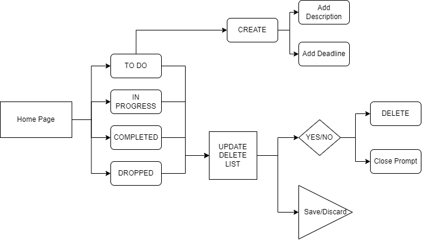

# EGEC-363-GRP3-Proj
Group 3 Project

## Web App 
[Kanban Board App](https://grp3-prj-app.streamlit.app/)

Please Keep in mind that database is visible to all users, contents not seperated by user

## Important Links 
 [Kanban Board Presentation](https://docs.google.com/presentation/d/15SwJrqFD1fFdjdOV2dm3QoGbZWFXdliPpo8KeF4PlKY/edit#slide=id.p)
 [Video Demo on Youtube](https://youtu.be/IQKjDdmUzJQ)
 [Complete Kanban Documentation](https://docs.google.com/document/d/18iklARlkvR9vMtxO9Rls-8i2jDQxDcdOEl9joiiH3Y0/edit?usp=sharing)

## Project Goals
User  Interface  :  
Design  a  user  interface  for  the  application  using  any  appropriate web based technology or combination of technologies  

-   Functionality  :  
Users should be able to add new tasks with a title, description, and due date.  Users should be able to view a list of all tasks.  Users should be able to update task details and mark tasks as complete.  Users should be able to delete tasks. 

 -   Data  Persistence  :  
 Implement  data  persistence  to  store  tasks  between  sessions. 
 You  can  use  a  simple  file-based  storage  system  or  a  lightweight  database  (e.g., SQLite/MongoDB).  
 
 -   Documentation  :  
 Provide  clear  documentation  for  your  code,  including  how  to  run 
 the application and any dependencies that need to be installed. 

## Flowchart

## Team Members
Giovanni Martinez
Jackie Li
Tyler Nguyen
Kaela sanchez 
Ethan Wu

## Update 2/23/2024
- Reconfirmed Tasks of each member from previous week 
- Shared github repository with each member 
- planned out github concepts 

## Update 4/09/2024
- Reconfirmed commitment of project
- Research on various web technologies 
- Delegation of tasks

# Update 4/12/2024 
- Optimal method found (stream lit)
- conceptual work
- visual mockup 
- Limits and Possibilities of Streamlit identified 

# Update 4/16/2024
- Release Candidate Introduced to team
- Last-Minute implementation of KanBot

# Update 4/18/2024
- Final Release 

